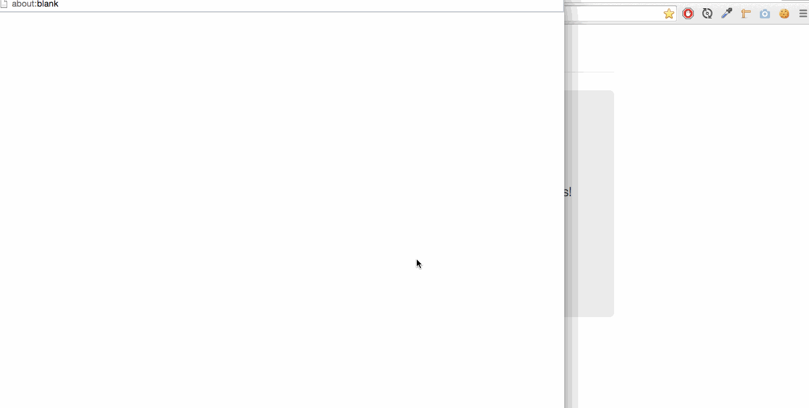

github-client-firebase
====================

Website
---
[<strong>&#8594; Here</strong>](https://pgu.firebaseapp.com/)

Purpose
---
Webapp that allows the search of public :octocat: repositories and show some analytics for the selected project, with **https**.



Technologies
---

Built with:

- [GitHub API](https://developer.github.com/v3/)
- [Bootstrap](http://getbootstrap.com/)
- [AngularJS](http://angularjs.org/)
- [Moment.js](http://momentjs.com/)
- [Lo-dash](http://lodash.com/)
- [Highcharts](http://www.highcharts.com/)
- [FireBase](https://www.firebase.com/)

Install
---
```
npm install && bower install
grunt serve
```
